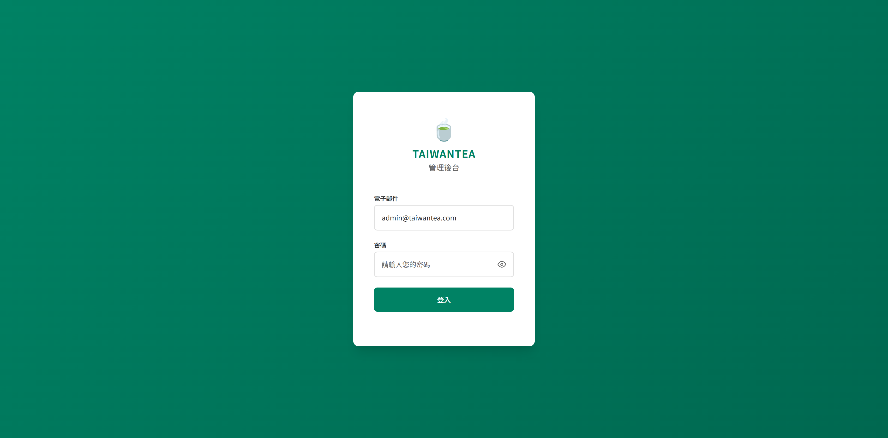
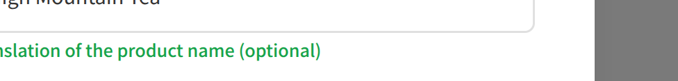

# 台灣茶葉網站 - 管理員使用指南

**版本**: 1.1
**更新日期**: 2025年11月1日

---

## 目錄

1. [圖片上傳規範](#1-圖片上傳規範)
2. [登入與工作階段](#2-登入與工作階段)
3. [雙語內容管理](#3-雙語內容管理)
4. [技術維護記錄](#4-技術維護記錄)

---

## 1. 圖片上傳規範

### 📸 標準規格

| 項目 | 規格 |
|------|------|
| **圖片尺寸** | **1200 × 1200 像素（正方形）** |
| **檔案格式** | **JPG** |
| **壓縮品質** | **80-85%** |
| **檔案大小** | **150-300 KB** |
| 最大檔案 | 5 MB（系統上限）|
| 色彩空間 | sRGB |
| 解析度 | 72 DPI |

---

### ✅ 拍攝要點

1. **光線充足** - 使用自然光，避免陰影
2. **背景簡潔** - 純白或淺色背景
3. **商品居中** - 佔畫面 70-80%
4. **清晰對焦** - 確保細節清楚

---

### 📋 上傳檢查清單

- [ ] 1200×1200 像素正方形
- [ ] JPG 格式
- [ ] 150-300 KB 檔案大小
- [ ] 背景乾淨簡潔
- [ ] 商品居中且清晰

---

### 🖼️ 系統自動處理

上傳一張圖片，系統自動產生：
- **完整尺寸** - 點擊放大檢視
- **縮圖** - 商品網格展示
- **小圖** - 行動裝置使用

所有圖片自動上傳到媒體伺服器 (mediaserver.frrut.com)。

---

### 🛠️ 推薦工具

**線上工具（免費）：**
- **Photopea** - https://www.photopea.com/ （裁切、調整大小）
- **Squoosh** - https://squoosh.app/ （圖片壓縮）
- **TinyPNG** - https://tinypng.com/ （JPG/PNG 壓縮）

**桌面軟體：**
- Adobe Photoshop（付費）
- GIMP（免費）

---

## 2. 登入與工作階段

### 🔐 登入說明

- **登入網址**: http://localhost:5173/admin/login
- **工作階段時效**: 24 小時
- **預設帳號**: admin@taiwantea.com（已預填）
- **預設密碼**: Admin123!
- **密碼顯示**: 點擊輸入框右側眼睛圖示可顯示/隱藏密碼



---

### ⏰ 工作階段管理

| 項目 | 說明 |
|------|------|
| 登入有效期 | 24 小時 |
| 閒置登出 | 無（24 小時內保持登入）|
| 跨分頁 | 共用登入狀態 |

**特色：**
- ✅ 一次登入可工作整天
- ✅ 24 小時內不會因逾時失去資料
- ✅ 可同時開啟多個管理頁面

---

### 💡 使用建議

1. **每天開始工作時登入一次** - 早上登入後可工作一整天
2. **工作結束時建議登出** - 點擊右上角「登出」按鈕
3. **多人共用電腦** - 務必登出，保護帳號安全

---

### ⚠️ 注意事項

- 24 小時後會自動登出，需重新登入
- 離開座位時鎖定螢幕
- 定期更改密碼（建議每 3 個月）
- 不要與他人分享管理員帳號

---

### 📞 技術支援

如有問題，請聯絡技術人員並提供：
- 問題發生時間
- 瀏覽器類型與版本
- 錯誤訊息截圖（如有）

---

## 3. 雙語內容管理

### 🌏 中英文雙語支援

系統支援**中文**與**英文**雙語內容，方便國際客戶瀏覽。

---

### 📝 填寫說明

#### 產品管理
- **產品名稱** - 中文名稱（必填）
- **English Name** - 英文名稱（選填）

**範例：**
- 產品名稱：`高山烏龍茶`
- English Name：`High Mountain Oolong Tea`



#### 分類管理
- **分類名稱** - 中文名稱（必填）
- **英文名稱** - 英文名稱（選填）

**範例：**
- 分類名稱：`烏龍茶`
- 英文名稱：`Oolong Tea`

---

### 👁️ 顯示位置

#### 管理後台
產品與分類列表會同時顯示中英文：
- **產品列表**：`產品名 • English Name`
- **分類標籤**：`分類名 (Category)`
- **分類標題**：`分類名 • Category (商品數)`


#### 客戶前台
- **導航選單**：顯示中英文雙語標籤
- **產品分類**：顯示英文分類名稱
- **產品卡片**：顯示英文分類標籤

---

### ✅ 填寫建議

1. **英文名稱建議填寫** - 提升專業度與國際形象
2. **使用標準翻譯** - 參考業界慣用術語
3. **保持一致性** - 同類商品使用相同翻譯風格
4. **首字母大寫** - 英文名稱使用 Title Case（如：`Green Tea`）

---

## 4. 技術維護記錄

### 🐛 已修復問題

#### 產品網格顯示不一致（2025年11月1日）

**問題描述：**
烏龍茶分類的產品卡片顯示尺寸異常，比其他分類的產品卡片更寬，導致第4欄商品被切斷。

**技術分析：**
- 當分類中有**8個產品**（剛好填滿4欄×2列）時，觸發瀏覽器CSS Grid渲染錯誤
- 烏龍茶區塊的欄寬被錯誤計算為 463px（應為 319px）
- 造成水平溢位：1912px（實際寬度）> 1336px（容器寬度）

**修復方式：**
修改 CSS Grid 樣板定義：
```css
/* 修改前 */
grid-template-columns: repeat(4, 1fr);

/* 修改後 */
grid-template-columns: repeat(4, minmax(0, 1fr));
```

**修復結果：**
- ✅ 所有分類的產品卡片寬度統一為 319px
- ✅ 支援任意數量的產品（1個、8個、20個以上皆正常）
- ✅ 保留交替背景色設計

**影響範圍：**
客戶前台 - 所有產品分類區塊

---

*最後更新：2025年11月1日*
*文件版本：v1.1*
