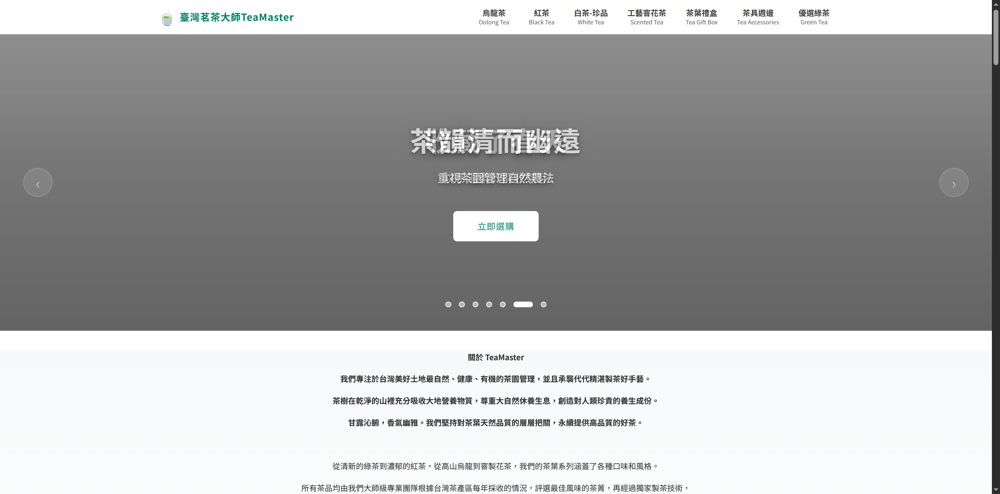
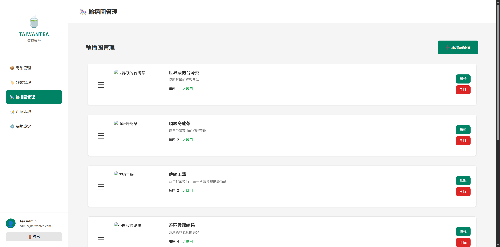
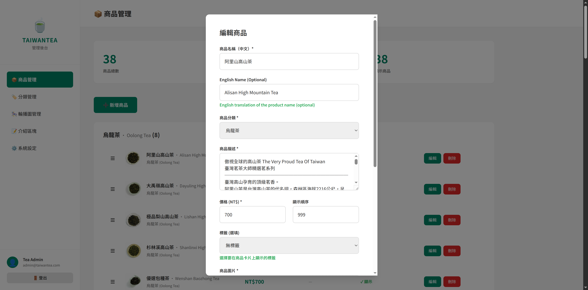
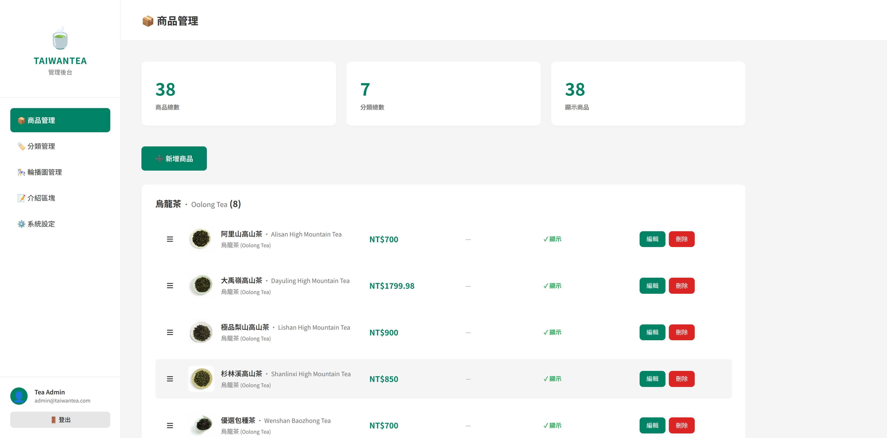
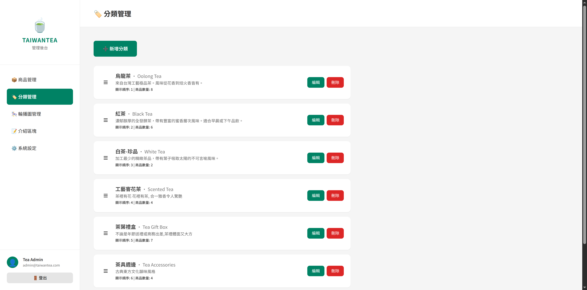
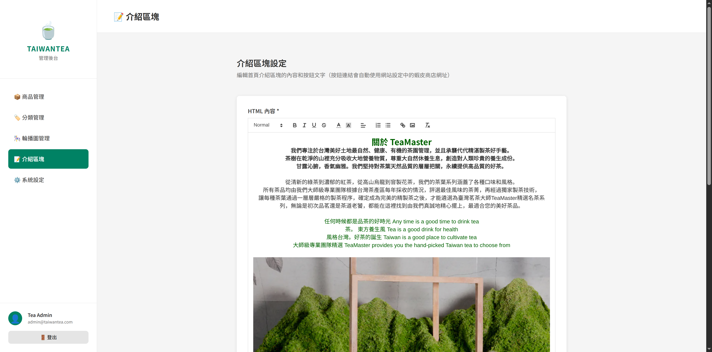

# 台灣茶葉網站 - 管理員快速指南

**版本**: 1.0
**更新日期**: 2025年11月2日

---

## 🔐 登入資訊

- **登入網址**: https://taiwantea.frrut.com/admin/login
- **預設帳號**: admin@taiwantea.com
- **預設密碼**: Admin123!
- **工作階段**: 24小時自動登出

*點擊眼睛圖示可顯示/隱藏密碼*

---

## 📸 圖片規格

### 產品圖片
- **尺寸**: 1200×1200 像素（正方形）
- **格式**: JPG
- **大小**: 150-300 KB
- **最多**: 6 張圖片/產品

*產品圖片會顯示在產品卡片上*

### 輪播橫幅
- **尺寸**: 1920×1080 像素（16:9）
- **格式**: JPG
- **大小**: 300-600 KB

*在管理後台上傳與管理輪播圖片*

**推薦工具**:
- [Photopea](https://www.photopea.com/) - 裁切、調整大小
- [Squoosh](https://squoosh.app/) - 壓縮圖片

---

## 🌏 雙語內容

所有產品與分類都支援中英文雙語：

**產品管理**:
- 產品名稱（中文）- 必填
- English Name - 選填

*產品表單中的英文名稱欄位*

**分類管理**:
- 分類名稱（中文）- 必填
- 英文名稱 - 選填

**範例**:
- 產品: `高山烏龍茶` / `High Mountain Oolong Tea`
- 分類: `烏龍茶` / `Oolong Tea`

*產品列表同時顯示中英文名稱*

*分類列表同時顯示中英文名稱*

---

## 📦 產品管理

### 多圖上傳（最多6張）
1. 進入產品表單
2. 點擊「+」上傳圖片
3. 使用 ← → 調整順序
4. 第一張 = 主圖

*產品支援上傳最多6張圖片，可使用箭頭調整順序*

### 富文本編輯器
支援格式化內容（標題、粗體、列表、圖片）

*富文本編輯器提供豐富的格式化功能*

**工具列功能**:
- H2/H3 標題
- **粗體**、*斜體*、底線
- 有序/無序列表
- 文字顏色、連結
- 插入圖片（最大 5 MB）

**使用區別**:
- **商品描述** - 簡短摘要（1-2句）
- **詳細介紹** - 完整說明（含格式）

*編輯的富文本內容會完整顯示在產品詳情頁*

---

## ✏️ 介紹區塊編輯器

首頁內容編輯器，支援：

- 文字格式化（標題、顏色、對齊）
- 圖片貼上（Ctrl+V 直接貼上截圖）
- 圖片調整大小（拖曳角落）
- 圖片對齊（左/中/右）
- CTA 按鈕設定

*介紹區塊編輯器支援富文本格式與圖片編輯*

**所見即所得** - 編輯器中的效果 = 前台顯示效果

---

## 🔧 常見功能

### 產品排序
拖曳產品卡片可調整顯示順序

### 分類管理
- 新增/編輯分類
- 設定分類排序
- 雙語名稱支援

### 輪播橫幅
- 上傳首頁橫幅圖片
- 調整顯示順序
- 啟用/停用

### 網站設定
- 網站標題
- 聯絡資訊
- 蝦皮商店連結

---

## 💡 快速提示

✅ **每天登入一次** - 24小時內無需重複登入
✅ **先寫內容再格式化** - 避免過度格式化
✅ **英文名稱建議填寫** - 提升國際形象
✅ **定期儲存** - 編輯過程中定期儲存
✅ **使用建議圖片尺寸** - 提升載入速度

---

## 📞 需要協助？

如遇問題，請提供：
- 問題發生時間
- 瀏覽器類型與版本
- 錯誤訊息截圖

---

**完整指南**: 參見 [管理員使用指南.md](./管理員使用指南.md)
