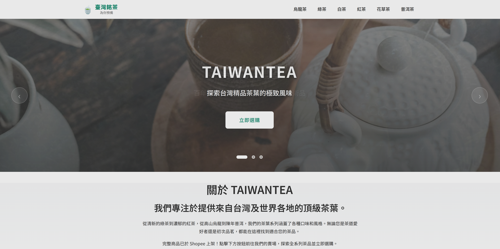
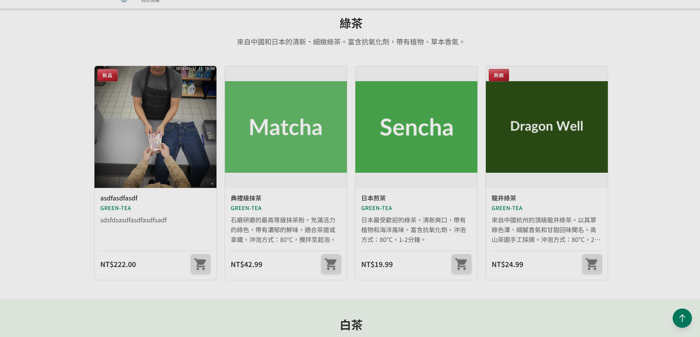
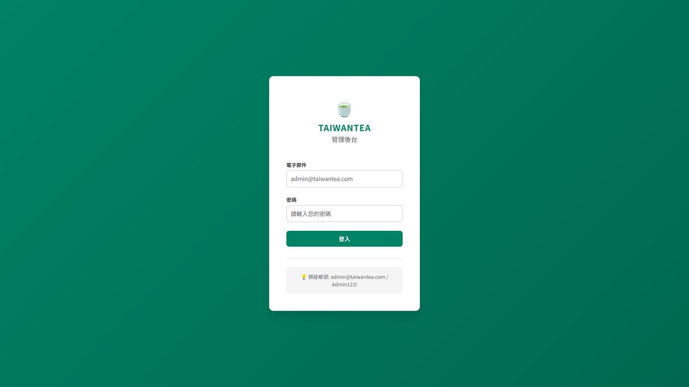
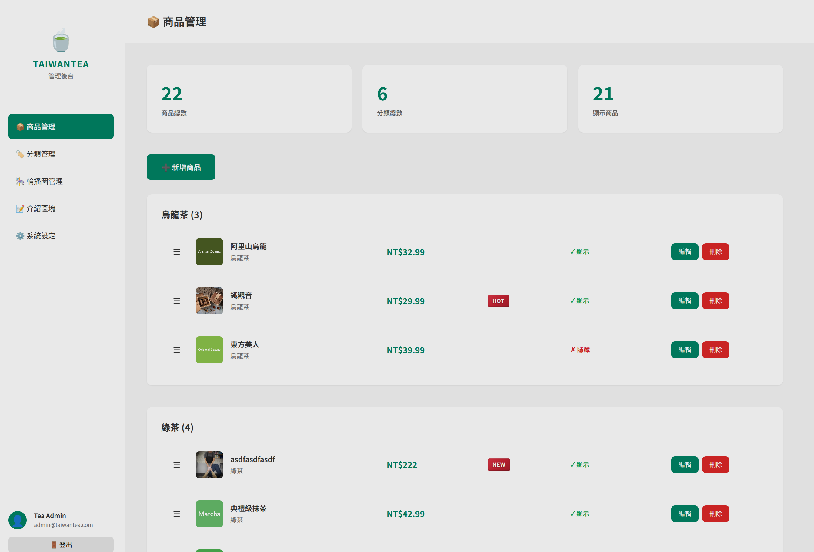
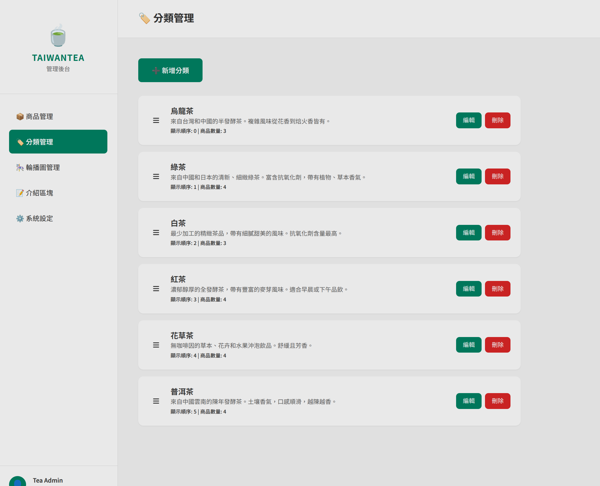
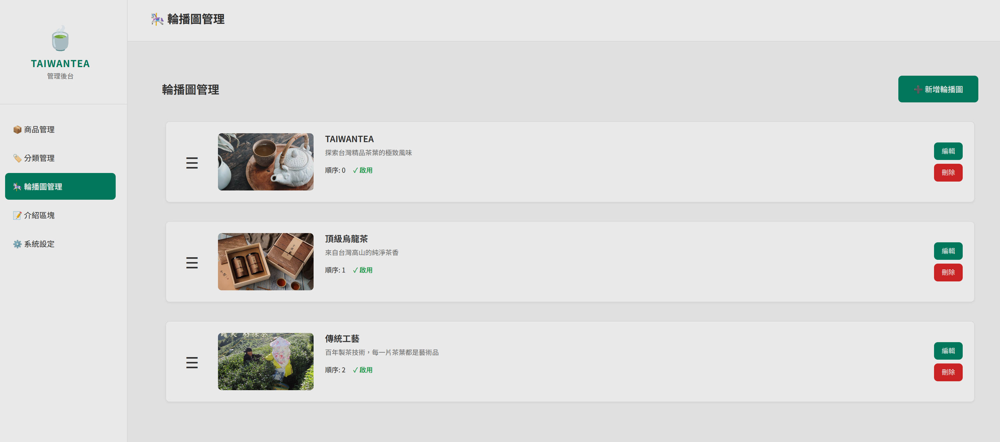
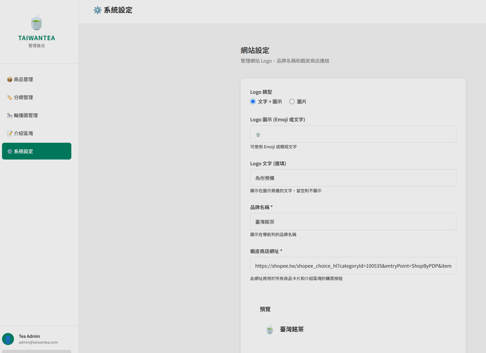

# TAIWANTEA 管理員操作手冊

**系統網址**: https://taiwantea.frrut.com/

---

## 目錄

### 前台展示
1. [客戶前台](#1-客戶前台)

### 管理後台
2. [登入系統](#2-登入系統)
3. [儀表板](#3-儀表板)
4. [產品管理](#4-產品管理)
5. [分類管理](#5-分類管理)
6. [輪播管理](#6-輪播管理)
7. [網站設定](#7-網站設定)
8. [登出系統](#8-登出系統)

---

## 1. 客戶前台

客戶前台是消費者瀏覽和購買茶葉的主要介面。

### 1.1 首頁

**主要元素**：
- **導航列**：顯示品牌 Logo「臺灣銘茶」及主選單，包含烏龍茶、綠茶、白茶、紅茶、花草茶、普洱茶等分類連結
- **輪播橫幅**：展示主要推廣內容，如「TAIWANTEA - 探索台灣精品茶葉的極致風味」，配有「立即選購」行動按鈕
- **關於區塊**：介紹品牌理念「關於 TAIWANTEA - 我們專注於提供來自台灣及世界各地的頂級茶葉」，包含詳細的品牌故事和蝦皮商店連結

**設計特點**：
- 大型橫幅圖片營造高品質茶葉的專業形象
- 清晰的分類導航方便顧客快速找到想要的茶類
- 輪播指示點顯示多張輪播圖片可切換

### 1.2 產品瀏覽

**綠茶分類展示**：
- **分類標題**：「綠茶」及分類說明「來自中國和日本的清新、細緻綠茶，富含抗氧化劑，帶有植物、草本香氣。」
- **產品卡片**：展示 4 款綠茶產品：
  - **asdfasdfasdf**：左側產品，標記「新品」標籤，價格 NT$222.00，附實拍產品照片
  - **典禮綠抹茶**：中左產品，抹茶系列，價格 NT$42.99，配有綠色主題背景
  - **日本煎茶**：中右產品，價格 NT$19.99，清新綠色設計
  - **龍井綠茶**：右側產品，標記「熱銷」標籤，價格 NT$24.99，深綠色調

**產品卡片資訊**：
- 產品名稱（中文及英文 ID）
- 產品圖片或純色背景設計
- 詳細描述（包含特色、沖泡方式等）
- 價格標示（新台幣）
- 蝦皮購物車按鈕（灰色購物車圖示）
- 特殊標籤（新品、熱銷等）

**互動功能**：
- 點擊購物車圖示可導向蝦皮賣場購買
- 卡片設計整齊排列，方便比較不同產品
- 響應式設計適應各種螢幕尺寸

### 管理員注意事項

管理員在後台所做的以下設定會直接影響前台展示：

1. **產品管理**：新增、編輯的產品會即時顯示在前台對應分類中
2. **產品排序**：拖曳調整的順序會影響前台產品顯示順序
3. **輪播圖**：後台設定的輪播圖片會在首頁橫幅輪播展示
4. **網站設定**：Logo、品牌名稱、蝦皮連結的修改會套用到所有前台頁面
5. **產品標籤**：設定的 HOT、NEW 等標籤會以紅色標記顯示在產品卡片上

> 💡 **提示**：修改內容後，建議開啟前台網頁確認顯示效果，確保顧客看到的資訊正確無誤。

---

## 2. 登入系統

### 操作說明
- 訪問管理後台網址：https://taiwantea.frrut.com/admin/login
- 輸入管理員帳號（電子郵件）
- 輸入密碼
- 點擊「登入」按鈕

### 預設管理員帳號
- **帳號**：admin@taiwantea.com
- **密碼**：Admin123!

> ⚠️ **注意**：首次登入後請立即修改密碼以確保系統安全

---

## 3. 儀表板

### 功能說明
儀表板是管理後台的首頁，整合產品管理功能與系統概覽資訊：

- **統計數據**：顯示產品總數（22個產品）、分類數量（6個分類）、展示產品數（21個）等關鍵指標
- **產品列表**：展示所有茶葉產品，包含名稱、價格（NT$）、特殊標籤（如HOT、NEW）
- **快速操作**：每個產品都有編輯和刪除按鈕，方便快速管理

### 主要功能模組
- 左側選單：包含商品管理、分類管理、輪播圖管理、介紹區塊、系統設定等導航連結
- 頂部工具列：顯示當前頁面標題與功能
- 底部使用者資訊：顯示登入帳號（Tea Admin - admin@taiwantea.com）

---

## 4. 產品管理

### 功能說明
產品管理模組用於管理商店的所有茶葉產品，包括新增、編輯、刪除和排序功能。

### 主要功能

#### 3.1 產品列表
- 顯示所有產品的清單，包含完整的產品資訊
- 產品卡片展示：產品圖片、名稱、價格（如阿里山烏龍 NT$32.99）
- 特殊標籤：顯示HOT、NEW等產品標記（如鐵觀音標記為HOT）
- 操作按鈕：每個產品都有編輯（鉛筆圖示）和刪除（垃圾桶圖示）按鈕

#### 3.2 新增產品
- 點擊「新增產品」按鈕
- 填寫產品資訊：
  - **產品名稱**：茶葉名稱（中文）
  - **分類**：選擇所屬分類（綠茶、紅茶、烏龍茶等）
  - **描述**：產品詳細介紹
  - **價格**：設定售價（USD）
  - **產品圖片**：上傳產品圖片（支援 JPG, PNG, WEBP 格式）
  - **庫存狀態**：設定是否有貨
  - **產品徽章**：可選擇「NEW」、「HOT」、「特價」等標籤

#### 3.3 編輯產品
- 點擊產品列表中的「編輯」按鈕
- 修改產品資訊
- 點擊「儲存」更新產品

#### 3.4 刪除產品
- 點擊產品列表中的「刪除」按鈕
- 確認刪除操作

#### 3.5 產品排序
- 使用拖放功能調整產品顯示順序
- 排序會即時套用到前台展示

> 💡 **提示**：產品圖片建議尺寸為 600x450 像素，以獲得最佳顯示效果

---

## 5. 分類管理

### 功能說明
分類管理用於管理產品分類，組織茶葉商品的分類結構。

### 主要功能

#### 4.1 分類列表
- 顯示所有產品分類，目前有6個分類：
  - **烏龍茶**：半發酵茶，介於綠茶和紅茶之間（8個產品）
  - **綠茶**：未發酵茶，保留最多的茶多酚和維生素（4個產品）
  - **白茶**：輕微發酵的茶類，製作工藝簡單（2個產品）
  - **紅茶**：全發酵茶，口感醇厚（4個產品）
  - **花草茶**：各種花草與茶葉的混合（2個產品）
  - **普洱茶**：後發酵茶，越陳越香（2個產品）
- 每個分類卡片顯示名稱、描述、產品數量及編輯/刪除按鈕

#### 4.2 新增分類
- 點擊「新增分類」按鈕
- 填寫分類資訊：
  - **分類名稱**：分類名稱（中文）
  - **分類 ID**：英文識別碼（如：green-tea, black-tea）
  - **描述**：分類說明
  - **狀態**：啟用/停用

#### 4.3 編輯分類
- 點擊分類列表中的「編輯」按鈕
- 修改分類資訊
- 點擊「儲存」更新分類

#### 4.4 刪除分類
- 點擊分類列表中的「刪除」按鈕
- 確認刪除操作

> ⚠️ **注意**：刪除分類前請確保該分類下沒有產品，否則可能影響產品顯示

---

## 6. 輪播管理

### 功能說明
輪播管理用於設定首頁橫幅輪播圖片，展示重點商品或促銷活動。

### 主要功能

#### 5.1 輪播列表
- 顯示所有輪播圖片，目前有3個輪播項目：
  - **TAIWANTEA**：主品牌輪播圖，展示茶園風景
  - **頂級烏龍茶**：推薦商品輪播，展示烏龍茶產品
  - **傳統工藝**：製茶工藝介紹，展示傳統製茶過程
- 每個輪播卡片顯示圖片預覽、標題、描述及編輯/刪除按鈕
- 可拖曳調整輪播順序（拖曳圖示在卡片左側）

#### 5.2 新增輪播
- 點擊「新增輪播」按鈕
- 填寫輪播資訊：
  - **標題**：輪播標題
  - **描述**：輪播說明文字
  - **圖片**：上傳輪播圖片（建議尺寸：1920x600 像素）
  - **連結 URL**：點擊圖片後的跳轉網址（選填）
  - **顯示順序**：設定輪播順序
  - **狀態**：啟用/停用

#### 5.3 編輯輪播
- 點擊輪播列表中的「編輯」按鈕
- 修改輪播資訊
- 點擊「儲存」更新輪播

#### 5.4 刪除輪播
- 點擊輪播列表中的「刪除」按鈕
- 確認刪除操作

#### 5.5 輪播排序
- 使用拖放功能調整輪播顯示順序
- 數字越小越優先顯示

> 💡 **提示**：輪播圖片建議使用高品質圖片，並優化檔案大小以提升載入速度

---

## 7. 網站設定

### 功能說明
網站設定模組用於配置網站的全域設定，包括Logo、品牌名稱及蝦皮商店連結等。

### 主要設定項目

#### 6.1 Logo 設定
- **Logo 類型**：可選擇「文字 + 圖示」或「圖片」兩種模式
- **Logo 圖示**：使用 Emoji 或圖示文字（目前使用茶杯圖示 🍵）
- **Logo 文字**：顯示的品牌名稱（標語），預設為「為你預備」

#### 6.2 品牌資訊
- **品牌名稱**：顯示在網站各處的品牌名稱，預設為「臺灣銘茶」
- 此名稱會顯示在導覽列、頁尾等位置

#### 6.3 蝦皮商店整合
- **蝦皮商店網址**：設定官方蝦皮賣場連結
- 範例：`https://shopee.tw/shopee_choice_hl?categoryId=100535&entryPoint=ShopByPDP&itemId=...`
- 此連結會顯示在所有產品卡片和相關頁面，引導顧客前往蝦皮下單購買

#### 6.4 預覽功能
- 設定頁面底部提供即時預覽
- 可看到 Logo 和品牌名稱的實際顯示效果（如「🍵 臺灣銘茶」）

### 操作步驟
1. 在網站設定頁面修改相應欄位
2. 點擊「儲存設定」按鈕
3. 設定會即時套用到前台網站

> 💡 **提示**：修改網站設定後，建議清除瀏覽器快取以查看最新變更

---

## 8. 登出系統

### 操作說明
- 點擊頂部工具列的使用者名稱或頭像
- 選擇「登出」選項
- 系統會自動返回登入頁面

> ⚠️ **安全提醒**：使用完畢後請務必登出系統，特別是在公用電腦上操作時

---

## 常見問題

### Q1: 忘記密碼怎麼辦？
A: 請聯絡系統管理員重設密碼。

### Q2: 上傳圖片有大小限制嗎？
A: 是的，單張圖片最大 5MB，支援 JPG、PNG、WEBP 格式。

### Q3: 產品排序如何生效？
A: 使用拖放功能調整順序後會自動儲存，立即在前台生效。

### Q4: 可以同時登入多個帳號嗎？
A: 可以，但建議使用不同瀏覽器或無痕模式，避免 session 衝突。

### Q5: 刪除的產品可以恢復嗎？
A: 目前無法恢復，刪除前請謹慎確認。

---

## 技術支援

如遇到任何問題或需要協助，請聯絡：

- **技術支援信箱**: support@taiwantea.com
- **系統管理員**: admin@taiwantea.com

---

## 附錄

### 系統需求
- **瀏覽器**: Chrome 90+, Firefox 88+, Safari 14+, Edge 90+
- **解析度**: 建議 1920x1080 或以上
- **網路**: 穩定的網際網路連線

### 更新記錄
- **v1.0.0** (2025-10-12): 初版發布

---

*本手冊最後更新時間：2025年10月12日*
